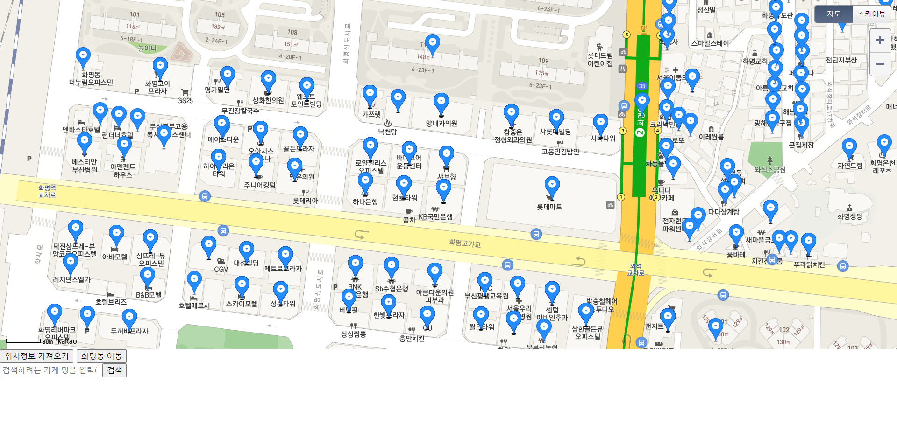
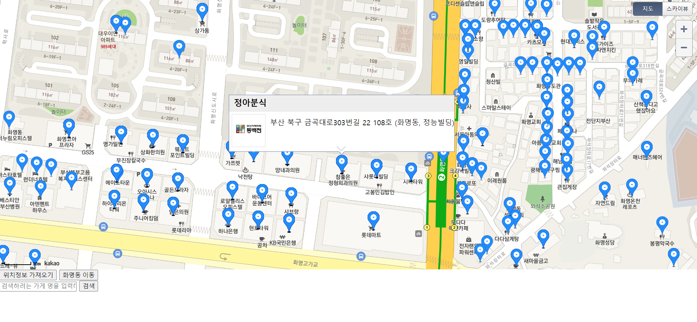
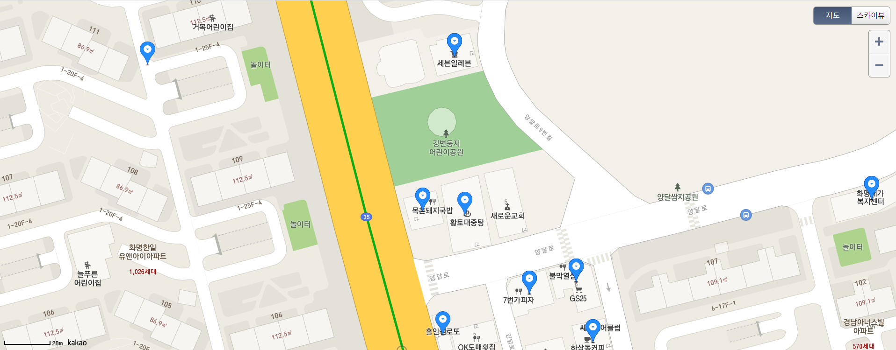

## 프로젝트 개요
  
  - 동백전 어플을 쓰면서, '왜 동백전 어플은 지도기능을 제공하지 않을까?' 라는 궁금증에서 시작. 직접 지도를 만드는 것이 목표

## 구현목표 / 진행현황

### 데이터 DB에 저장 O
  - pandas 라이브러리를 이용하여 데이터를 처리하고, 이를 DB에 저장
### 지도 검색 기능 !O
  - 데이터 베이스 기반으로 검색 기능 구현, but 마커들이 겹치는 경우 일부가게는 지도에서 파악할 수가 없다는 문제가 발생하였다.
### 동백전 가맹가게 지도 표시 O
  - 카카오 API 기능을 사용하여 가맹가게를 지도에 표시
  
### 지도 표시된 마커위에 마우스를 올리면 정보 표시 O
  - 여러가지 방법을 찾아보았으나, 여러 마커들에 대해 각 마커를 클릭하여 정보가 표시되게하는 것은 카카오맵 API에서 제공하는 기능으로 구현하는데 한계.
  - 차선책으로 마커위에 마우스를 올리면 정보가 표시되는 방법으로 변경
  
### GPS 기능을 사용하여 현재 위치 파악 O
  - navigator 라이브러리를 사용하여 위치를 파악, 사용자의 위치로 지도 중심을 변경하여, 주변의 동백전 가맹점 파악가능
  
### 소감/ 발전방향
 - 동백전 공공데이터를 이용하여, DB에 저장하고 이를 사용하여봤는데, 엄청나게 많은 시간이 소요되었다. 일단 DB에 데이터를 넣는거부터 엄청 많은 시간이 소요되었고, 데이터를 불러오는데도 엄청나게 많은 시간이 소요되었다. sqlite이 sql을 채택하여 사용해서 그런지  데이터의 용량이 커지니까 시간이 오래걸렸다. 사람들이 이러한 문제를 처리하기 위해, NOSQL 데이터베이스를 사용한다는 생각을 했다. 다음번에는 MONGO DB에 대해 공부하고 이를 사용해봐야 겠다.
 - 동백전 어플을 쓰면서, '왜 동백전 어플은 지도기능을 제공하지 않을까?' 라는 의문을 해결하기 위해 도전하였는데, 이는 프로젝트를 하면서 깨닫게 되었다. 동백전의 시행사인 코나아이/BNK는 회사 자체로 만든 지도 API가 없기 때문에, 카카오/네이버/구글등의 맵 API를 빌려와야하는데 이는 편리하긴 하지만, API 제공 회사에서 제공한 규칙에 따라서만 작동하기 때문에, 구현에 애로사항이 많았을 것으로 생각되어 구현하지 않은것이라는 생각을 하게 되었다. 실제로 동백전 홈페이지에 들어가보면, 각 가게들에 대해서는 개별로 카카오맵 API를 이용하여, 위치정보를 지도로 표시해주지만, 전체적인 지도는 제공하지 않는다.
 - API를 이용해 본적은 있지만, 실제로 혼자 사용해 본적은 처음이다. 생각보다 API는 많은 정보와 기능이 있다는 것을 알았고, 우리가 사용하는 많은 시스템에 이미 적용되어 있다는 것을 깨닫는다. 다음에 API를 사용할 일이 있다면 잘 사용할 자신이 있다.
 - 공공데이터 포탈에서 동백전 가맹점 정보를 받아 이를 DB에 저장하고, 결측값을 처리하고, 원하는 영역 ('북구', '화명동')의 정보만 db에 저장하도록 설정하였다. 또한, 이렇게 저장된 정보를 DB에서 로드하여 카카오맵에 마커로 표시하였는데, 생각보다 간단한 작업이었음에도 익숙하지가 않아서 많이 헤맸던 것 같다. 더 연습해서 익숙해질때까지 익혀야겠다.
 - 마커가 겹쳐, GPS 정보가 같은 가게들중 일부 가게를 볼 수 없는 문제가 발생하였는데, 이를 어떻게 처리할지 좀 더 고민해봐야겠다.